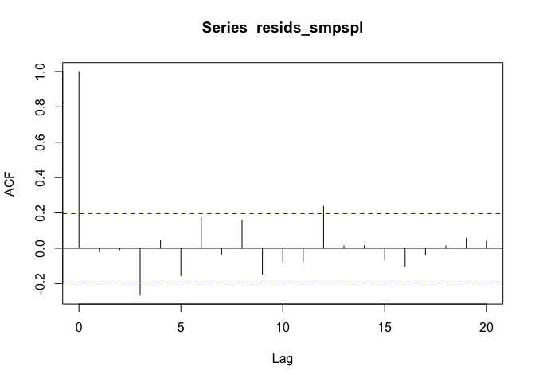

<!-- README.md is generated from README.Rmd. Please edit that file -->

# smpspl

<!-- badges: start -->

[](https://lifecycle.r-lib.org/articles/stages.html#experimental)
[](https://CRAN.R-project.org/package=smpspl)
<!-- badges: end -->

The goal of `smpspl` is to perform sample splitting. Time series data
are inherently ordered with the time index which means standard sampling
schemes that randomly split the data are inapplicable. We propose a
sample splitting paradigm where goodness-of-fit tests can be performed
based on a sample splitting approach where the first `f_n` terms are
used for estimating the model and the last `l_n` terms are used for
obtaining the resiudals. Doing so, under certain circumstances, yields
residuals that behave like the true noise process and inference on the
appropriateness of a model can be made.

## Installation

You can install the development version of smpspl like so:

``` r
pak::pkg_install("leonfernandes/smpspl")
```

## Sample splitting

The main function is `smpspl` which fits a model on the first `f_n`
terms of the data and yields residuals based on the last `l_n` terms.

``` r
library(smpspl)
library(fable)
#> Loading required package: fabletools
library(tsibble)
#> 
#> Attaching package: 'tsibble'
#> The following objects are masked from 'package:base':
#> 
#>     intersect, setdiff, union
library(dplyr)
#> 
#> Attaching package: 'dplyr'
#> The following objects are masked from 'package:stats':
#> 
#>     filter, lag
#> The following objects are masked from 'package:base':
#> 
#>     intersect, setdiff, setequal, union
# Generate AR(1) data
data <-
  tsibble(
    x = arima.sim(model = list("ar" = 0.7), n = 100),
    date = Sys.Date() + 0:99,
    index = date
  )

# Consider fitting an AR(10) model using sample splitting
resids_smpspl <-
  ARIMA(x ~ 0 + pdq(10, 0, 0) + PDQ(0, 0, 0)) |>
  smpspl(data, 50, 100) |>
  pull(.resid)

# Save the full residuals
resids_full <-
  data |>
  model(arima = ARIMA(x ~ 0 + pdq(10, 0, 0) + PDQ(0, 0, 0))) |>
  residuals() |>
  pull(.resid)

# Plot the ACF
resids_full |>
  acf()
```


``` r
resids_smpspl |>
  acf()
```



The details of which sample splitting settings to use for ARMA/GARCH
models will be the subject of an upcoming paper.
